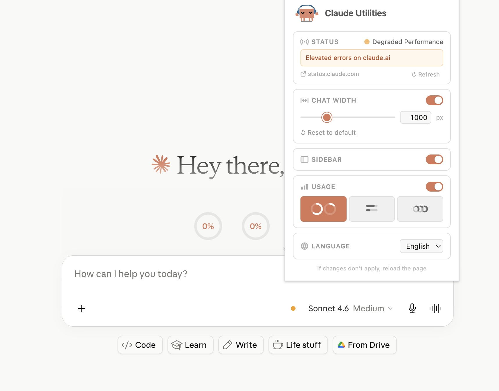
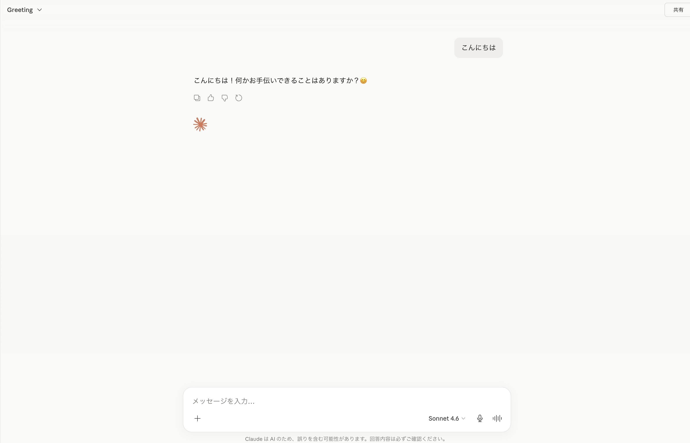
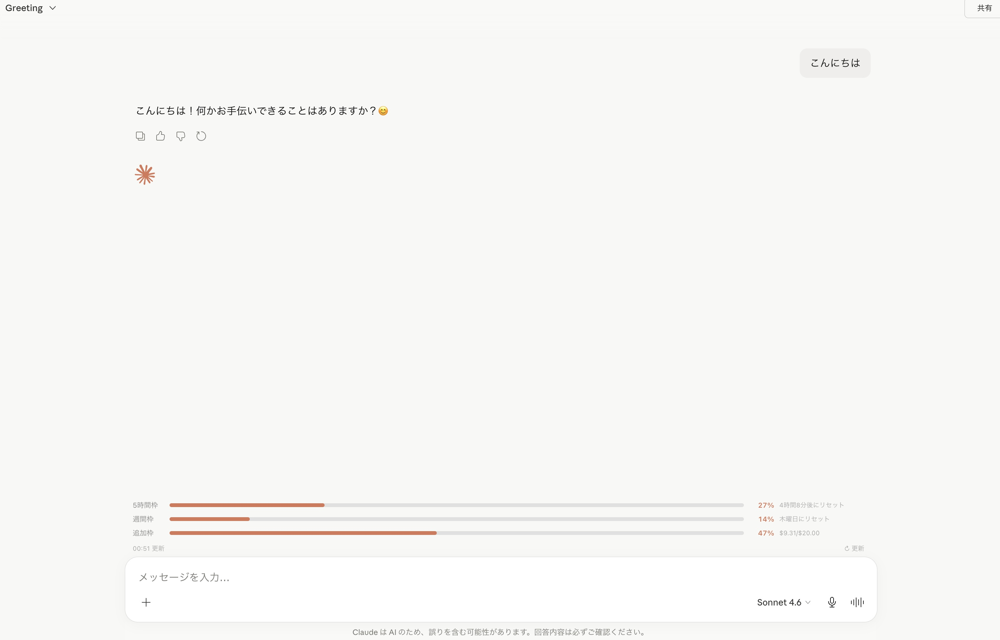

# Claude Utilities

Claude (Chrome 版) をより快適に使うための Chrome 拡張機能です。

<div align="center">
  
</div>

## 機

### チャット幅調整

チャット本文エリアの最大幅を自由に変更できます。

- 650〜2000px の範囲で調整可能（デフォルト 1000px）
- 拡張機能アイコンのポップアップからスライダーまたは数値入力で設定

### 使用量

チャット入力欄の上に使用量をリアルタイムで表示します。

- 5時間セッション枠・週間枠・追加枠の使用率を プログレスバー / ドーナツチャート の2種類で表示可能
- 残り10%未満で赤色に変化
- Claudeの返答完了後に自動更新

## スクリーンショット

### Before



### After



## インストール方法

1. [Releases](../../releases) から最新の `claude-utilities-vX.X.X.zip` をダウンロード
2. 解凍する
3. Chrome で `chrome://extensions/` を開く
4. 右上の **「デベロッパーモード」** をオンにする
5. 左上の **「パッケージ化されていない拡張機能を読み込む」** をクリック
6. 解凍したフォルダを選択する

<details>
<summary>オプション: git clone から入れる（開発者向け）</summary>

最新の `main` を試したい場合や、ソースを改変して使う場合のみ、こちらでも同じように入れられます。

```bash
git clone https://github.com/otanitakeru/claude-utilities-chrome-extension.git
cd claude-utilities-chrome-extension
```

手順 3〜5 は上と同じです。手順 6 では、clone したリポジトリ内の **`src` フォルダ** を選んでください（Release ZIP を解凍したフォルダと同じ中身です）。

</details>

## ライセンス

MIT

## クレジット

アイコンのピクセルアートキャラクター（Clawd）は [marciogranzotto/clawd-tank](https://github.com/marciogranzotto/clawd-tank) の SVG アセットを一部改変して使用しています。
原作者: Marcio Granzotto Rodrigues（MIT License）
