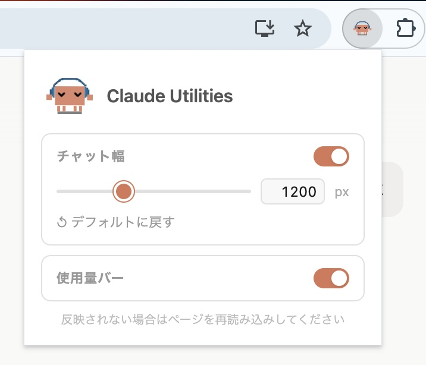

# Claude Utilities Chrome Extension

Claude (chrome) をより快適に使うための Chrome 拡張機能です。

## スクリーンショット

### Before


### After


### ポップアップ



## 機能

### 使用量バー

チャット入力欄の上に使用量をリアルタイムで表示します。

- 5時間セッション枠・週間枠・追加枠の使用率をプログレスバーで表示
- 残り10%未満で赤色に変化
- Claudeの返答完了後に自動更新

### チャット幅調整

チャット本文エリアの最大幅を自由に変更できます。

- 800〜2000px の範囲で調整可能
- 拡張機能アイコンのポップアップからスライダーまたは数値入力で設定

## インストール

1. [Releases](../../releases) から最新の `claude-utilities-vX.X.X.zip` をダウンロード
2. 解凍する
3. Chrome で `chrome://extensions/` を開く
4. 右上の **「デベロッパーモード」** をオンにする
5. 左上の **「パッケージ化されていない拡張機能を読み込む」** をクリック
6. 解凍したフォルダを選択する

## 開発

```bash
git clone https://github.com/YOUR_USERNAME/claude-utilities-chrome-extension.git
cd claude-utilities-chrome-extension
```

`src/` フォルダを Chrome の拡張機能ページから読み込むだけで動作します。

## リリース

タグを push すると GitHub Actions が自動的に ZIP を作成して Release に添付します。

```bash
git tag v1.0.0
git push origin v1.0.0
```

## ライセンス

MIT

## クレジット

アイコンのピクセルアートキャラクター（Clawd）は [marciogranzotto/clawd-tank](https://github.com/marciogranzotto/clawd-tank) の SVG アセットを一部改変して使用しています。
原作者: Marcio Granzotto Rodrigues（MIT License）
